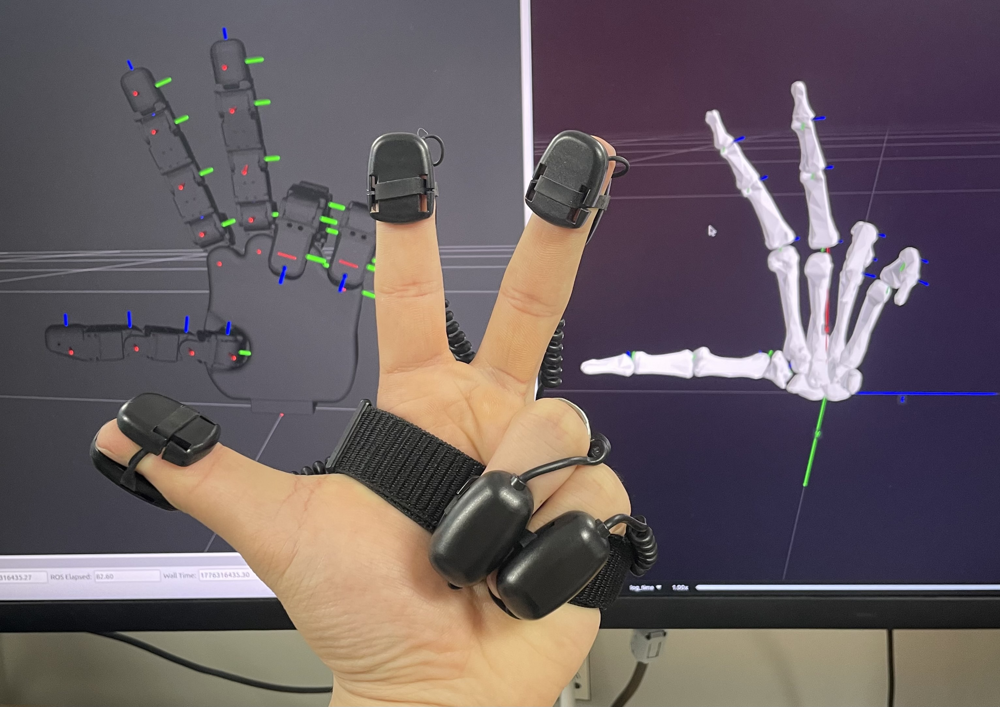

# atlas_hand

ROS 2 기반 로봇 손 제어 패키지 — Air Glove Atlas(AGA) 글러브 데이터를 수신하여 HX5 D20 로봇 손을 실시간으로 제어합니다.

[](https://docs.ros.org/en/jazzy/)
[](https://www.python.org/)
[](LICENSE)



## 개요

AGA 글러브의 17개 관절 쿼터니언을 OSC 프로토콜로 수신하여  
Pinocchio 기반 Forward Kinematics → dex-retargeting IK 파이프라인으로 로봇 핸드의 관절 각도로 변환하는 **Python ROS 2 패키지**입니다.

모든 연산 및 시각화의 좌표축은 **Unity 좌표계(Left-Handed)** 를 기준으로 설계되었습니다.

---

## 시스템 아키텍처

```
[Air Glove Atlas]
  /left/quat/get   — float×68 (17관절×4)
  /right/quat/get  — float×68 (17관절×4)
        │ 
        ▼
┌─────────────────────┐
│    osc_receiver     │  
└─────────────────────┘
        │
  /left_hand/quaternions   (Float32MultiArray, 68 floats)
  /right_hand/quaternions  (Float32MultiArray, 68 floats)
        │
        ▼
┌────────────────────────────────────────────┐
│               retarget (노드)               │
│  1. FK  — Pinocchio spherical joint        │
│  2. 좌표 변환 — Quest frame → 로봇 frame      │
│  3. 스케일 보정                              |
│  4. IK  — dex-retargeting                  │
│  5. Low-pass Filter                        │
└────────────────────────────────────────────┘
        │
  /joint_states  (sensor_msgs/JointState)
        │
        ▼
  [Robot Hand]
```

---

## 패키지 구조

```
atlas_hand/
├── package.xml
├── setup.py
├── setup.cfg
├── requirements.txt
├── resource/
│   └── atlas_hand                        # ament 패키지 마커
├── atlas_hand/                           # Python 소스
│   ├── config.py                       # OSC 설정 및 AGA SDK 상수
│   ├── nodes/
│   │   ├── osc_receiver.py             # AGA 글러브 OSC 수신 → ROS 2 토픽
│   │   ├── retargeting.py              # Position 기반 리타겟팅 노드
│   │   └── visualizer.py              # Rerun 3D 시각화 노드
│   └── core/
│       └── hand_spherical_fk.py        # Pinocchio FK + Rerun 시각화 클래스
├── config/
│   └── hand_data.json                  # 손 기구학 데이터 
├── launch/
│   ├── atlas_hand.launch.py            # 메인 런처 (OSC + 리타겟팅)
│   ├── left_hand_view.launch.py        # 왼손 URDF 뷰어 (RViz2)
│   └── right_hand_view.launch.py       # 오른손 URDF 뷰어 (RViz2)
├── urdf/
│   ├── hands/
│   │   ├── hx5_d20_left.urdf           # Robotis HX5 D20 왼손
│   │   └── hx5_d20_right.urdf          # Robotis HX5 D20 오른손
│   ├── left_hand/
│   │   ├── urdf/left_hand_rerun.urdf
│   │   └── meshes/stl/                 # 왼손 STL 메쉬
│   └── right_hand/
│       ├── urdf/right_hand_rerun.urdf
│       └── meshes/stl/                 # 오른손 STL 메쉬
├── rviz/
│   ├── left_hand_view.rviz
│   └── right_hand_view.rviz
└── docker/
    ├── Dockerfile
    └── docker.sh

```

---

## 의존성

### ROS 2

- Ubuntu 24.04 + ROS 2 Jazzy

```bash
sudo apt install ros-jazzy-sensor-msgs ros-jazzy-std-msgs ros-jazzy-trajectory-msgs
```

### Python

```bash
pip install -r requirements.txt
```

| 패키지            | 용도           |
| ----------------- | -------------- |
| `numpy`           | 수치 연산      |
| `scipy`           | 회전 변환      |
| `pin`             | Pinocchio (FK) |
| `dex-retargeting` | IK 최적화      |
| `rerun-sdk`       | 3D 시각화      |
| `python-osc`      | OSC UDP 통신   |

---

## 설치 및 빌드 (Docker 권장)

의존성 패키지 설치가 복잡하므로 Docker 사용을 권장합니다.

### Docker 사용법

호스트와 컨테이너 모두에서 DDS 전송을 UDPv4로 고정해야 통신이 안정적입니다.

```bash
# 0. 호스트에서 먼저 설정 (필수)
export FASTDDS_BUILTIN_TRANSPORTS=UDPv4

# 1. 이미지 빌드
./docker/docker.sh build

# 2. 컨테이너 접속
./docker/docker.sh enter
```

### 로컬 빌드 (Ubuntu 24.04 기준)

```bash
cd ~/ros2_ws/src
git clone <repo_url>

cd ~/ros2_ws
pip install -r src/atlas_hand/requirements.txt
colcon build --packages-select atlas_hand
source install/setup.bash
```

---

## 실행

### 전체 시스템

```bash
# 호스트에서도 반드시 설정
export FASTDDS_BUILTIN_TRANSPORTS=UDPv4

ros2 launch atlas_hand atlas_hand.launch.py
# hand_type: left | right | both (기본값: both)
#robotis_hx5 : hand_rerun | robotis_hx5 | Can Add (기본값: hand_rerun)
ros2 launch atlas_hand atlas_hand.launch.py hand_type:=left robot_config:=robotis_hx5
```

### 개별 노드

```bash
# OSC 수신
ros2 run atlas_hand osc_receiver

# 리타겟팅 (기본값: 뼈대 URDF hand_rerun)
ros2 run atlas_hand retarget --ros-args -p hand_type:=left
ros2 run atlas_hand retarget --ros-args -p hand_type:=right

# 특정 로봇 핸드 지정
ros2 run atlas_hand retarget --ros-args -p hand_type:=left -p robot_config:=robotis_hx5

# 3D 시각화 (Rerun)
ros2 run atlas_hand visualizer left spawn    # 로컬 뷰어(기본값)
ros2 run atlas_hand visualizer left connect  # 외부 뷰어 연결

# URDF 뷰어 (RViz2)
ros2 launch atlas_hand left_hand_view.launch.py
ros2 launch atlas_hand right_hand_view.launch.py
```
---

## 토픽

| 토픽                      | 타입                         | 발행 노드    |
| ------------------------- | ---------------------------- | ------------ |
| `/left_hand/quaternions`  | `std_msgs/Float32MultiArray` | osc_receiver |
| `/right_hand/quaternions` | `std_msgs/Float32MultiArray` | osc_receiver |
| `/joint_states`           | `sensor_msgs/JointState`     | retarget     |

### 데이터 포맷

```
Float32MultiArray.data (68 floats):
  [x0,y0,z0,w0, x1,y1,z1,w1, ..., x16,y16,z16,w16]
  sensor[0] = 손목  /  sensor[1~16] = 관절 (JOINT_ORDER 순서)
```

---

## 주요 파라미터

| 파라미터          | 기본값 | 설명                           |
| ----------------- | ------ | ------------------------------ |
| `LP_FILTER_ALPHA` | `0.35` | Low-pass 필터 (0=정지, 1=직통) |
| `TIMER_SEC`       | `0.02` | 제어 루프 주기 (50 Hz)         |
| `IK_MAX_TIME`     | `0.01` | IK 최대 계산 시간 (10 ms)      |

[atlas_hand/nodes/retargeting.py](atlas_hand/nodes/retargeting.py) 상단에서 수정합니다.

---

## 새 로봇 핸드 추가

1. `HandConfig`를 상속하는 클래스를 [atlas_hand/core/hand_configs.py](atlas_hand/core/hand_configs.py)에 구현
2. `CONFIG_REGISTRY`에 키 등록
3. 실행 시 `--ros-args -p robot_config:=<key>`로 선택

---

## 라이선스

Proprietary — © WHATsLAB. All rights reserved.

본 소프트웨어의 소스 코드 및 알고리즘에 대한 권리는 WHATsLAB에 있으며, 무단 복제 및 배포를 금합니다.

---

### Third-Party Data & Attribution
본 프로젝트는 시각화 및 키네마틱스 모델링을 위해 아래의 외부 데이터를 포함하고 있으며, 각 데이터는 원저작자의 라이선스 정책을 따릅니다.

#### 1. ROBOTIS Hand 2 (URDF & Meshes)
Origin: [ROBOTIS-GIT/robotis_hand_2](https://github.com/ROBOTIS-GIT/robotis_hand)

Copyright: © ROBOTIS Co., Ltd.

License: Apache License 2.0

Location: [urdf/hands/](urdf/hands/) 하위 모델 데이터

Changes: 프로젝트의 ROS 2 환경에 맞춰 URDF 파일의 경로 수정 및 물리 파라미터 최적화가 수행되었습니다.

#### 2. BodyParts3D (Anatomical 3D Models)
Copyright: © The Database Center for Life Science (DBCLS)

License: Creative Commons Attribution 4.0 International (CC BY 4.0)

Changes: 프로젝트의 목적(ROS 2 시뮬레이션 및 FK 연산)에 맞춰 원본 메쉬의 스케일 조정, 좌표축 변경 및 URDF 호환을 위한 리깅(Rigging) 작업이 수행되었습니다.