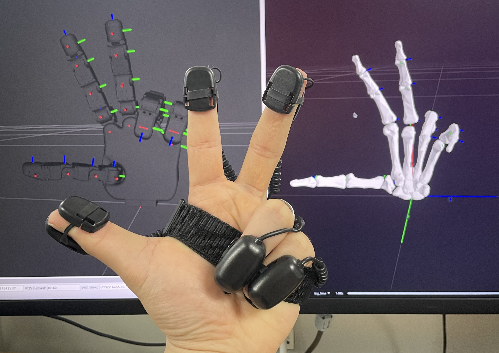

# atlas_hand

핸드 데이터를 수신하여 로봇 손을 실시간으로 제어하는 패키지입니다.

[](https://docs.ros.org/en/jazzy/)
[](https://www.python.org/)
[](LICENSE)



---

## 개요

핸드의 키포인트 관절 쿼터니언을 수신하여  
Pinocchio 기반 Forward Kinematics → dex-retargeting IK 파이프라인으로 로봇 핸드의 관절 각도로 변환합니다.

모든 연산 및 시각화의 좌표축은 **Unity 좌표계(Left-Handed)** 를 기준으로 설계되었습니다.

### 지원 입력 소스

| 소스 | 프로토콜 | 햅틱 피드백 |
| ---- | -------- | ----------- |
| **AGA 글러브** (Atlas) | OSC UDP | ✅ |
| **Meta Quest** | Binary UDP | ❌ |

#### AGA 글러브 연결

AGA 글러브는 [WHATsLAB 공식 사이트](https://www.whatslab.co.kr/)에서 구매할 수 있습니다.  

#### Meta Quest 연결

1. [`readme/HandTrackingData.apk`](readme/HandTrackingData.apk)를 Meta Quest 헤드셋에 설치합니다.
2. PC와 Meta Quest를 **같은 Wi-Fi**에 연결합니다.
3. Meta Quest에서 앱을 실행하면 MXFIND 브로드캐스트로 PC를 자동 발견하여 연결됩니다.

### 실행 모드

| 모드 | 설명 | 필요 환경 |
| ---- | ---- | --------- |
| **ROS 2** | 전체 노드 파이프라인, 햅틱 피드백, RViz2 시각화 | Ubuntu 24.04 + ROS 2 Jazzy |
| **Standalone** | ROS 없이 직접 실행 — Rerun 시각화 또는 콘솔 IK 출력 | Python 3.10+ |

---

## 시스템 아키텍처

```
[AGA 글러브]  OSC UDP  ┐
                       ├→ HandInputSource → Hand Forward Kinematics → HandRetargeter → [Robot Hand]
[Meta Quest]  UDP     ┘
```

```
atlas_hand_core/sources/
├── AtlasGloveSource  — OSC 수신, 하트비트, 햅틱 송신
└── MetaQuestSource   — Binary UDP 수신

atlas_hand_core/
├── HandRetargeter    — FK (Pinocchio) → IK (dex-retargeting)
└── HandSphericalFK   — Pinocchio 기반 관절 FK
```

> ROS 2 토픽 상세: [readme/topics.md](readme/topics.md)

---

## 패키지 구조

```
atlas_hand_ROS2/
├── atlas_hand/                           # ROS 2 노드 패키지
│   ├── config.py                         # ROS 2 토픽 이름 상수
│   ├── input_receiver_node.py            # 입력 소스 → ROS 2 토픽 브릿지
│   ├── retargeting_node.py               # 리타겟팅 노드 (HandRetargeter 래퍼)
│   └── visualizer_node.py               # Rerun 3D 시각화 노드
│
├── atlas_hand_core/                      # Python 코어
│   ├── config.py                         # 하드웨어 / 알고리즘 상수
│   ├── hand_configs.py                   # 핸드 모델별 리타겟팅 설정
│   ├── hand_spherical_fk.py              # Pinocchio FK 클래스
│   ├── retargeter.py                     # HandRetargeter — FK → IK 파이프라인
│   └── sources/                          # 입력 소스 모듈
│       ├── __init__.py                   # create_source() 팩토리
│       ├── base.py                       # HandInputSource ABC
│       ├── atlas_glove.py               # AtlasGloveSource (OSC)
│       └── meta_quest.py                # MetaQuestSource (Binary UDP)
│
├── standalone/                           # ROS 2 없이 실행 가능한 스크립트
│   ├── visualize.py                      # 입력 소스 → Rerun 3D 시각화
│   └── retarget.py                       # 입력 소스 → FK → IK → 콘솔 출력
│
├── scripts/                              # 개발/테스트 유틸리티
│   └── test_haptic_left.py               # 왼손 햅틱 수동 테스트 (1/2 키)
│
├── models/                               # 핸드 모델 서브모듈 → dexterous-hand-urdf
│   ├── base_hand/       — urdf/ meshes/ assets/ rviz/
│   ├── orca_hand/       — urdf/ meshes/ rviz/
│   ├── robotis_hx5_d20/ — urdf/ meshes/ rviz/
│   ├── allegro_hand/    — meshes/ (URDF 루트)
│   ├── leap_hand/       — meshes/ (URDF 루트)
│   ├── schunk_hand/     — meshes/ (URDF 루트)
│   └── tesollo_dg5f/    — meshes/ (URDF 루트)
│
├── launch/
│   ├── atlas_hand.launch.py              # 메인 런처
│   └── hand_view.launch.py               # URDF 뷰어
└── docker/
```

---

## 가이드

| 모드 | 문서 |
| ---- | ---- |
| ROS 2 | [readme/ros2_guide.md](readme/ros2_guide.md) |
| Standalone | [readme/standalone_guide.md](readme/standalone_guide.md) |
| 새 로봇 핸드 추가 | [readme/adding_hand_config.md](readme/adding_hand_config.md) |
| ROS 2 토픽 목록 | [readme/topics.md](readme/topics.md) |

---

## 라이선스

Proprietary — © WHATsLAB. All rights reserved.

본 소프트웨어의 소스 코드 및 알고리즘에 대한 권리는 WHATsLAB에 있으며, 무단 복제 및 배포를 금합니다.

---

## Third-Party Data & Attribution

본 프로젝트는 시각화 및 키네마틱스 모델링을 위해 아래의 외부 데이터를 포함하고 있으며, 각 데이터는 원저작자의 라이선스 정책을 따릅니다.

#### 1. ROBOTIS Hand 2 (URDF & Meshes)

Origin: [ROBOTIS-GIT/robotis_hand_2](https://github.com/ROBOTIS-GIT/robotis_hand)  
Copyright: © ROBOTIS Co., Ltd.  
License: Apache License 2.0  
Location: [models/robotis/](models/robotis/)  
Changes: ROS 2 환경에 맞춰 URDF 경로 수정 및 물리 파라미터 최적화.

#### 2. BodyParts3D (Anatomical 3D Models)

Copyright: © The Database Center for Life Science (DBCLS)  
License: Creative Commons Attribution 4.0 International (CC BY 4.0)  
Changes: ROS 2 시뮬레이션 및 FK 연산 목적에 맞춰 메쉬 스케일 조정, 좌표축 변경, URDF 리깅 작업 수행.

#### 3. Orca Hand (URDF & Meshes)

Copyright: © Soft Robotics Lab (SRL), ETH Zurich  
License: MIT License  
Origin: [orcahand_description](https://github.com/orcahand/orcahand_description)
Changes : Tip 위치에 fixed joint 추가
