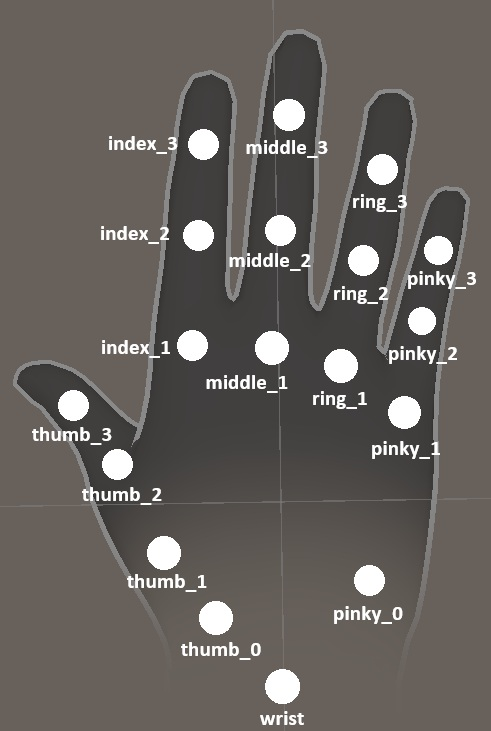

# 새 로봇 핸드 추가 가이드

`atlas_hand/core/hand_configs.py`에 새 핸드 설정을 추가하는 방법을 설명합니다.  
서브클래스에서 **메서드 오버라이드 없이 클래스 변수 선언만으로** 동작을 완전히 정의할 수 있습니다.

---

## 개념 정리

### FingerChain

손가락 하나의 URDF 링크 체인 + 대응 MediaPipe 인덱스를 묶는 데이터 클래스입니다.

```python
@dataclass
class FingerChain:
    links: List[str]   # 루트→팁 링크명 ({side}, {wrist} 플레이스홀더 사용 가능)
    human: List[int]   # MediaPipe 키포인트 인덱스 (links와 동일 길이)
```

`links[0]`이 루트(wrist), `links[-1]`이 팁(fingertip)입니다.  
- **stage1 (VectorOptimizer)**: `links[:-1]` → origin, `links[1:]` → task
- **stage2 (PositionOptimizer)**: `links[-1]` → 손끝 타겟

### Human Hand 인덱스 레이아웃


| Index | 관절 명칭 (Bone Name) | 설명 (Description) |
| :---: | :--- | :--- |
| **0** | `wrist` | 손목 중심점 (Root) |
| **1** | `thumb_0` | 엄지 손바닥 쪽 뿌리 (CMC) |
| **2** | `thumb_1` | 엄지 첫 마디 (MCP) |
| **3** | `thumb_2` | 엄지 중간 마디 (IP) |
| **4** | `thumb_3` | 엄지 끝 마디 (Distal) |
| **5** | `thumb_tip` | **엄지 최종 끝점 (Tip)** |
| **6** | `index_1` | 검지 뿌리 (MCP) |
| **7** | `index_2` | 검지 중간 마디 (PIP) |
| **8** | `index_3` | 검지 끝 마디 (DIP) |
| **9** | `index_tip` | **검지 최종 끝점 (Tip)** |
| **10** | `middle_1` | 중지 뿌리 (MCP) |
| **11** | `middle_2` | 중지 중간 마디 (PIP) |
| **12** | `middle_3` | 중지 끝 마디 (DIP) |
| **13** | `middle_tip` | **중지 최종 끝점 (Tip)** |
| **14** | `ring_1` | 약지 뿌리 (MCP) |
| **15** | `ring_2` | 약지 중간 마디 (PIP) |
| **16** | `ring_3` | 약지 끝 마디 (DIP) |
| **17** | `ring_tip` | **약지 최종 끝점 (Tip)** |
| **18** | `pinky_0` | 새끼손가락 손바닥 쪽 뿌리 (CMC) |
| **19** | `pinky_1` | 새끼손가락 뿌리 (MCP) |
| **20** | `pinky_2` | 새끼손가락 중간 마디 (PIP) |
| **21** | `pinky_3` | 새끼손가락 끝 마디 (DIP) |
| **22** | `pinky_tip` | **새끼손가락 최종 끝점 (Tip)** |

### 플레이스홀더

`FingerChain.links`의 링크명에 포함할 수 있는 포맷 문자열입니다.

| 플레이스홀더 | 치환값 출처 | 기본값 |
|---|---|---|
| `{side}` | `_SIDE_MAP[hand_type]` | `'left'` / `'right'` (full word) |
| `{wrist}` | `_WRIST_LINK[hand_type]` | 클래스 변수에서 지정 |

---

## 클래스 변수 레퍼런스

| 변수 | 타입 | 기본값 | 설명 |
|---|---|---|---|
| `_MODEL_SUBDIR` | `str` | `''` | `models/{subdir}/urdf` 경로 |
| `_FINGERS` | `Dict[str, List[FingerChain]]` | `{'left':[], 'right':[]}` | 손가락 체인 (좌우 키로 분리) |
| `_WRIST_LINK` | `Dict[str, str]` | `{'left':'world', 'right':'world'}` | TF parent frame 링크명 |
| `_COORD_TRANSFORM` | `np.ndarray` (3×3) | `np.eye(3)` | Atlas → 로봇 좌표계 변환 |
| `_SCALE_FACTOR` | `float \| List[float]` | `1.0` | Human 포지션 스케일. `List`로 지정하면 손가락별(thumb→index→middle→ring→pinky 순) 개별 스케일 적용 |
| `_URDF_FILENAME` | `str` | `'{hand_type}.urdf'` | URDF 파일명 포맷 |
| `_SIDE_MAP` | `Dict[str, str]` | `{'left':'left', 'right':'right'}` | `{side}` 플레이스홀더 치환값 |
| `_FIXED_JOINTS` | `Dict[str, str]` | `{}` | IK 후 0으로 고정할 조인트 |
| `_WRIST_JOINTS` | `Dict[str, Dict[str, List[float]]]` | `{'left':{}, 'right':{}}` | 손목 직접 매핑: `{조인트명: 회전축[x,y,z]}`. 비어 있으면 비활성화 |

---

## Case 1: 대칭 핸드 (좌우 링크명이 `{side}` 패턴)

좌우가 같은 구조이고 링크명에 `left_` / `right_` 접두사가 붙는 경우입니다.  
`_chains`를 한 번 정의하고 좌우에 공유합니다.

```python
class MyHandConfig(HandConfig):
    _MODEL_SUBDIR = 'my_hand'                             # models/my_hand/urdf/
    _WRIST_LINK   = {'left': 'left_base', 'right': 'right_base'}
    _COORD_TRANSFORM = np.array([...], dtype=np.float32)  # 필요 시
    _SCALE_FACTOR = 1.2                                   # 필요 시

    _chains = [
        FingerChain(  # Thumb
            links=["{side}_base", "{side}_thumb_1", "{side}_thumb_2", "{side}_thumb_tip"],
            human=[0, 2, 3, 5],
        ),
        FingerChain(  # Index
            links=["{side}_base", "{side}_index_1", "{side}_index_2", "{side}_index_tip"],
            human=[0, 6, 7, 9],
        ),
        # ... 나머지 손가락
    ]
    _FINGERS = {'left': _chains, 'right': _chains}
```

`{side}` → `hand_type` 그대로 치환 (`left` / `right`).

---

## Case 2: 대칭 핸드 + 약어 side + {wrist} 플레이스홀더

side 약어(`l`/`r`)를 쓰거나, wrist 링크명이 링크 체인 안에 들어가는 경우입니다.  
URDF 파일명이 기본 패턴과 다를 때도 `_URDF_FILENAME`만 바꾸면 됩니다.

```python
class MyHandConfig(HandConfig):
    _MODEL_SUBDIR  = 'my_hand'
    _URDF_FILENAME = 'my_hand_{hand_type}.urdf'           # 기본 '{hand_type}.urdf'와 다를 때
    _SIDE_MAP      = {'left': 'L', 'right': 'R'}          # {side} → 'L' / 'R'
    _WRIST_LINK    = {'left': 'my_left_base', 'right': 'my_right_base'}
    _COORD_TRANSFORM = np.array([...], dtype=np.float32)
    _SCALE_FACTOR  = 1.3

    _chains = [
        FingerChain(
            links=["{wrist}", "finger_{side}_1", "finger_{side}_2", "finger_end_{side}"],
            human=[0, 6, 7, 9],
        ),
        # ...
    ]
    _FINGERS = {'left': _chains, 'right': _chains}
```

`{wrist}` → `_WRIST_LINK[hand_type]` 로 치환.  
`{side}` → `_SIDE_MAP[hand_type]` → `'L'` 또는 `'R'`.

---

## Case 3: 비대칭 핸드 (좌우 링크명이 완전히 다름)

OrcaHand처럼 좌우 링크 식별자가 다른 경우 `_FINGERS`에 직접 분리해서 정의합니다.  
`{wrist}` 플레이스홀더는 동일하게 사용할 수 있습니다.

```python
class MyHandConfig(HandConfig):
    _MODEL_SUBDIR = 'my_hand'
    _WRIST_LINK   = {'right': 'R-Base_abc123', 'left': 'L-Base_def456'}
    _COORD_TRANSFORM = np.array([...], dtype=np.float32)
    _SCALE_FACTOR = 1.1

    _FINGERS = {
        'right': [
            FingerChain(
                links=["{wrist}", "R-Thumb-1_abc", "R-Thumb-2_def", "R-Thumb-Tip"],
                human=[0, 2, 3, 5],
            ),
            # ...
        ],
        'left': [
            FingerChain(
                links=["{wrist}", "L-Thumb-1_xyz", "L-Thumb-2_uvw", "L-Thumb-Tip"],
                human=[0, 2, 3, 5],
            ),
            # ...
        ],
    }
```

---

## Case 4: 손목 직접 매핑 (`_WRIST_JOINTS`)

IK 대신 AGA 센서 0번(wrist) 쿼터니언을 직접 swing-twist 분해해 손목 조인트를 구동하는 경우입니다.

```python
class MyHandConfig(HandConfig):
    _MODEL_SUBDIR = 'my_hand'
    _WRIST_LINK   = {'left': 'my_left_base', 'right': 'my_right_base'}

    # 손목 조인트 직접 매핑: {조인트명: 로봇 프레임 회전축 [x,y,z]}
    # 회전축은 단위 벡터. 결과 단위: rad.
    _WRIST_JOINTS = {
        'right': {
            'wrist_flex_joint':  [0, 1, 0],   # Y축 굴곡/신전
            'wrist_rot_joint':   [1, 0, 0],   # X축 내전/외전
        },
        'left': {},   # 왼손은 IK 사용
    }
```

- 손목 조인트는 `robot_qpos[0]`에 직접 대입됩니다.
- `_WRIST_JOINTS`가 비어 있는 손 방향(`{}`)은 IK 결과를 그대로 사용합니다.
- 실시간 디버그 토픽 `/{side}_hand/wrist_xyz` 에서 확인 가능합니다:  
  `data[0:4]` = 원시 쿼터니언(raw), `data[4:7]` = Euler XYZ(rad), `data[7+]` = swing-twist 각도(rad)

---

## 손가락별 스케일 (`_SCALE_FACTOR`)

`float` 대신 `List[float]`를 지정하면 손가락별(thumb→index→middle→ring→pinky 순) 스케일을 개별 적용합니다.

```python
class MyHandConfig(HandConfig):
    # 5개 값: [thumb, index, middle, ring, pinky]
    _SCALE_FACTOR = [1.1, 1.2, 1.2, 1.3, 1.4]
```

리스트 길이가 손가락 수보다 짧으면 나머지 손가락은 1.0이 적용됩니다.

---

## 등록 및 실행

[`hand_configs.py`](../atlas_hand/core/hand_configs.py) 하단의 `CONFIG_REGISTRY`에 키를 추가합니다.

```python
CONFIG_REGISTRY: Dict[str, Type[HandConfig]] = {
    "robotis_hx5": RobotisHX5Config,
    "base":        BaseHandConfig,
    "orca_hand":   OrcaHandConfig,
    "my_hand":     MyHandConfig,      # ← 추가
}
```

실행:

```bash
ros2 run atlas_hand retarget --ros-args -p hand_type:=left -p robot_config:=my_hand
```

---
